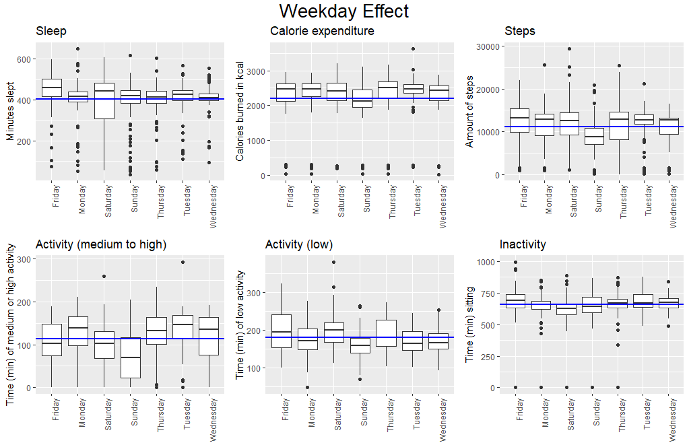
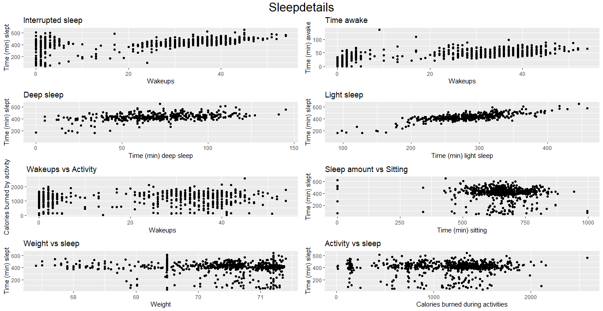
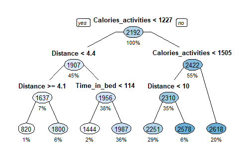
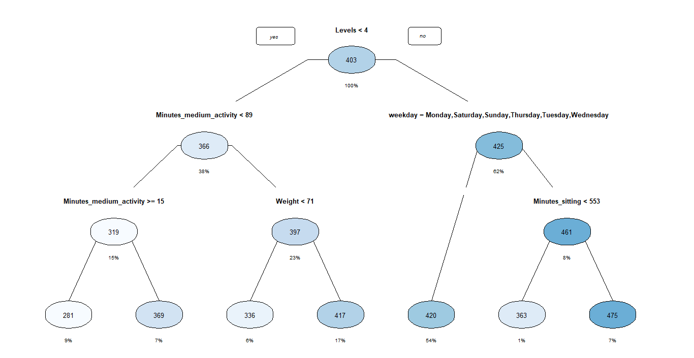
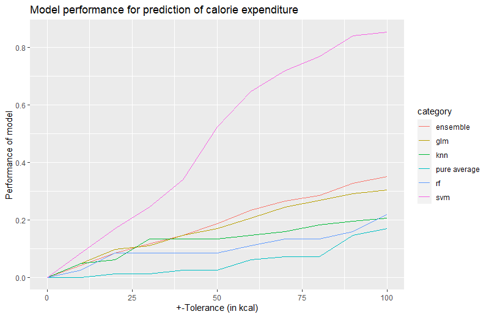
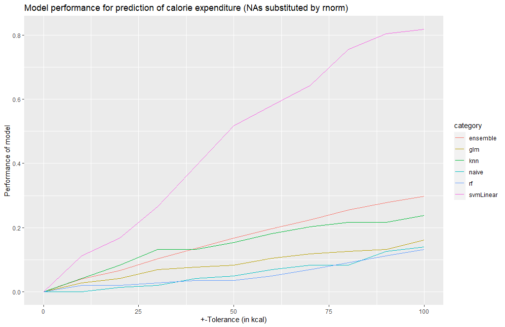
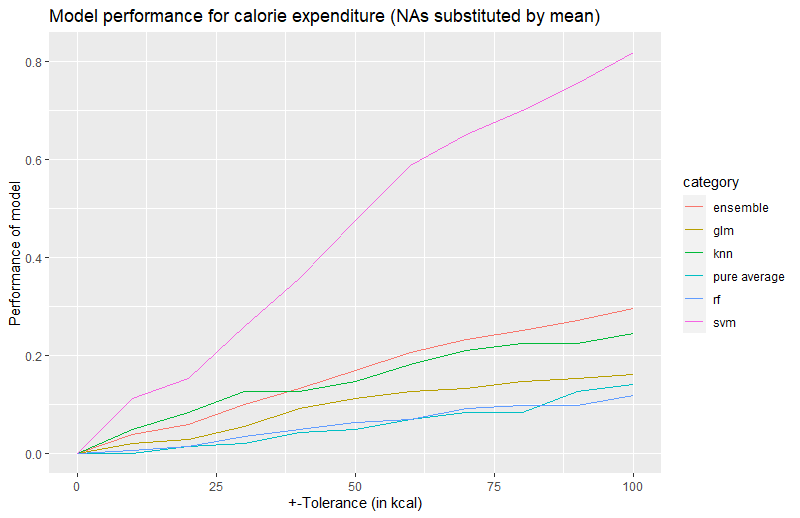
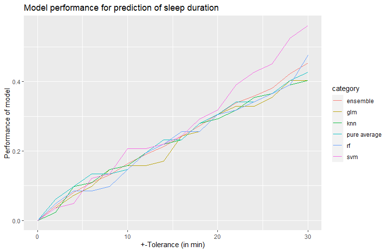

```{r setup, include=FALSE}
knitr::opts_chunk$set(echo = TRUE)
```

\newpage
# Introduction

Self-optimization is a huge topic resulting - amongst others - in a boom of smartwatches and fitness gadgets. I am guilty of having a fitness tracker for some time now, documenting what I claim to be an active and rather constant lifestyle. This collected quite some data from 05/2017-02/2020 that I can look into now in more detail.

Fitness trackers in general collect a wide amount of data depending on the device. The most common tracked values are steps, calories burned, activities, and sleep. 

While there was a wide variety of other data at hand, too, an attempt was made to predict sleep and calories burned and explore general trends assuming a strong relationship between activities, weekdays, and sleep patterns in this project.

Before the predictions were attempted, the data was explored by looking at a weekday effect, which might hold different activity and sleep patterns for weekends compared to weekdays. Also, the detailed sleep data was used to check for relationships between sleep phases and activities. Lastly, before predictions, regression trees were formed.

While burned calories were predictable in 85% of the cases, using the General Linear Model and a slight tolerance of 100 kcal, sleep prediction performed poorly and was even with a tolerance of 30 minutes only matching the actual data in approx. 56% of the cases with the best model, providing only low predictive value. An approach to handle not available (NA) values resulted in a slight decrease in performance of all models, depending on the variant chosen to handle those values. 

\newpage
# Methods and Analysis

## Background of the Data and Potential Limitations
The data were collected with two different devices. During the time the data was collected, several functionalities were implemented from the company Fitbit that I expect to have some influence on the data which was collected. 

Also, the second device had extended capabilities to measure oxygen saturation in the blood which I expect to influence the data in the presented datasets, too, e.g. for sleep data. However, the oxygen saturation value itself was not added to the dataset presented here.

## Data Wrangling
After loading both datasets `fitbit_sleep` and `fitbit_activities` still contains string values, indicating missing values. The string "NA"s are replaced with actual `NA` values. The dates are formatted and the times cut from the dates. Also, weekday is added.
Following, both tables are joined via date into one data frame (`fitbit_data`) and split into a test (`fitbit_test`) and a training set (`fitbit_training`) in a 20%/80% split. For the test set, `NA`-values are excluded, since they are excluded in predicting the values for `fitbit_test` later in this main dataset.

The full data set `fitbit_data` will be used for general data exploration.

### Side Sets, removing NA values
In the hope to improve predictions by keeping more datasets instead of omitting `NA` data, `NA` values in `fitbit_data` are transformed into actual values and stored to different data frames as described in this section. Overall, entries are made in 294 rows in that way. Both dataframes do not contain any `NA` values anymore.

#### Rnorm


In the first approach, data is stored to `fitbit_no_na`. In order to not completely inflate the significance of the results but could take away some of the correlation value, the following method was used, leveraging rnorm.
```{r eval=FALSE}
rnorm(n=sum(is.na(x)), mean=mean(x, na.rm=TRUE),sd=sd(x, na.rm=TRUE))
```
This dataset is split again in a test and training set and will be used for calorie prediction only, since it is not wanted in e.g. plots and general data exploration.

#### Mean


In order to check on performance for a different `NA` substitute method, a third dataset is created: `fitbit_mean` which is later split in test and training set, too.
The following method was used (pure mean):
```{r eval=FALSE}
mean(Minutes_REM,na.rm = TRUE)
```

 
## Data Exploration
The data ranges from 05/2018-02/2020. There are 703 observations and 19 columns in `fitbit_data`, containing detailed information about activities and sleep.

An average day looks roughly like this:

Parameter                 |Value
---------                 |-----
Average sleeping duration | 402.66 Minutes 
Average steps per day     | 11204
Average calories burned per day     | 2209 kcal
Average minutes performing light activity per day     | 181.18 Minutes
Average minutes performing high and medium activity per day     | 113.62 Minutes
Average minutes spent sitting per day    | 656.45 Minutes

### NA Values in Sleep Data

The only `NA` values are located in the columns `Minutes_REM`,    `Minutes_light_sleep`    and `Minutes_deep_sleep`. Those define the different phases of sleep, that are tracked. 
Before 01/01/2019 and in a timeframe between 12/01/2019 - 12/15/2019, all values are `NA`. In all other cases, `NA` is only for individual nights. Those coherent timeframes are consistent with a different device that was unable to track the data precisely.

The other `NA`s however were unevenly distributed and not coherent. Note that for those values however, the `Minutes_slept` value is still existent!
Those were filtered and marked in Figure \ref{fig:na_sleep_values}.

```{r na_sleep_values, echo=FALSE, fig.cap="NA sleep values", out.width = '100%'}
knitr::include_graphics("https://i.ibb.co/nsFLV6z/naps.png") 
```


This plot implicates that quite some of those values are rather short sleep periods, possibly too short to get to different sleep phases. Most of the individual `NA` values are significantly under der average sleeptime.

### Weekday Effect
Something that seems quite obvious is that behavior is not the same throughout the week. One would expect longer sleep periods during weekends and potentially irregular activity levels. Those might affect calorie expenditure and amount of steps per weekday.
I decided to check on this hypothesis.

```{r weekday_effect, echo=FALSE, fig.cap="Weekday effect", out.width = '100%'}

```

The blue lines in all plots of Figure \ref{fig:weekday_effect} indicate the average value. 
For sleep, it becomes obvious that I sleep on average longer on Fridays and Saturdays, whereas Saturday also has the biggest interrange quartile (between approx 300 and 430 Minutes). In general, the quartiles are all rather similar and rather small across the weekdays.

When it comes to calorie expenditure, all days except for Sunday have a median above average with a similarly small quartile and low interquartile range.

For steps, the effect is slightly bigger even, with Sunday being below average for the entire interquartile range. From the two plots, a correlation between steps and calorie expenditure already seems possible.

Medium to highly exhausting activity shows the biggest differences between medians of individual weekdays with Friday and Saturday being slightly under average and Sunday being clearly under average. The interquartile range is bigger than in the three previous plots.
Activity that is in a lower heart frequency range (low activities) follows a different trend:
Monday, Saturday, Sunday, Tuesday, and Wednesday are below average.

Hypothetically speaking, one could assume that on days with highly demanding activities, the low activities might be decreased and increased on days with less exhausting activities. Sunday is again the only exception from this hypothesis and appears to be a day of rest for me more often than not.

Inactivity, measured by minutes spent sitting, are across all weekdays very similarly distributed with again a low interquartile range.

### Sleep Details

In the Fitbit dataset, there is quite some level of detail for different sleep phases. It appears obvious that activities might have an impact on sleep quality and sleep duration. I decided to explore the data via some plots around sleep details:



The first plot shows the correlation between overall time spent sleeping and the number of times I woke up per night. As to be expected, with higher sleep duration the number of wakeups tends to increase. We can see a similar positive correlation between time awake (meaning time that I was awake while I was in bed) and amount of wakeups.

The time spent in deep sleep appears to only slightly increase with an increase in overall sleep time. The correlation between light sleep and overall sleep time appears to be stronger.

There is no clear correlation between calories burned by activities (indicating higher and lower activity levels per day) and the number of wakeups. Similarly, there is also no clear correlation between inactivity (minutes spent sitting) and overall time slept.

For the plot that indicates weight vs sleep time, it is visible that many values were logged with the same weight (69.5 kg and slightly above 71 kg). Overall, significantly more values were logged for weight >69 kg which is why it is tough to confirm any correlation. We will see later in a regression tree that there appears to be at least some indication from the weight value.

In the last plot, the relationship between activity level and overall sleep amount is explored. It seems to be not correlated.

### Regression Trees

After the data exploration via plots, a more holistic view on driving factors for predictions was gathered for calorie expenditure, and sleep data.


#### Calorie Expenditure


For calorie expenditure, the full data set of `fitbit_data` was used, resulting in the following tree:



The main driver for the burned calories is the calories burned by sports (calories_activities). The value for differentiation is 1227 (kcal). 55% of the data lies above that value, 20% of the values even have a value greater than 1505 (kcal). If the value is between 1227 and 1505, Distance < 10 (in km) is the differentiating factor. Only 8% of the data is from days where the calories burned by sports were below 1505 (kcal) but the walked distance was above 10 (km).

Also on the other side of the tree, where the value for calories burned by sports is below 1227 (kcal), the distance stays the next main driver with a value of 4.4 (km) as a differentiator. For those occurrences where the value is greater, time in bed is the next node in the tree, with only 2% being under the threshold of 114 (min) and 36% of the data being above it. For the occurrences where the value of 4.4 (km) was not reached, the next node is again on distance for a slightly lower value (4.1 (km)) as a differentiator that covers overall only 7% of the data.

#### Sleep


For sleep duration, the data set of `fitbit_data` still contained data that would have been misleading: `Minutes_awake`, `Minutes_REM`, `Minutes_light_sleep`, `Minutes_deep_sleep`, `Wakeup_amount` and `Time_in_bed` all contain values that are directly related to the overall sleep time and should not be included when e.g. running predictions.

Therefore, those columns are excluded first and the tree is built with the data frame `fitbit_data_stripped`.



The top of the tree is `Levels` which describes how many floors - or how much altitude - were overcome at a given day. 62% of the data lay above a value of 4. For that 62 %, the next determining factor is indeed the Weekday: 54% of the data goes directly to a leaf, explicitly all weekdays except for Friday. For Friday, the only remaining node differentiates by looking at the time spent sitting with a differentiating value of 553 (minutes).

If on a given day, less than 4 levels had been overcome (38%), minutes in medium activity are evaluated next. If those are over 89 (minutes), weight becomes a driving factor with a differentiating value of 71 (kg). Otherwise, the time spent with medium activity is checked.

## Data Prediction
To perform predictions, in general the function `prediction(tolerance, testset, trainset, column, average, plottitle, xtitle, ytitle)` is called. This function handles for all four predictions (Calories Burned with NA excluded, Calories Burned with NA substituted by rnorm, Calories Burned with NA substituted by mean and Sleep) by accepting all needed values to handle those calculations. The function returns a plot of the performance of the different models as well as the normalized Root Mean Square Error (NRMSE).
`tolerance` is a sequence of numbers that defins a tolerated deviation from the predicted value. `testset` is the test dataframe, `trainset` the training dataframe and `column` marks the column that needs to be evaluated. `average` is the respective average value to be used for a very naive approach, that compares all models to predicting only averages. `plottitle` sets the correct title for the output plot, while `xtitle` and `ytitle` label the axis.

The call for e.g. prediction of burned calories looks like this:
```{r eval=FALSE}
cal_tolerance<-seq(0,100,10)

prediction(cal_tolerance, fitbit_test, fitbit_train, "Calories_Burned",
           average_calories,
           "Model performance for prediction of calorie expenditure",
           "+-Tolerance (in kcal)", "Performance of model")
```


### Calorie Expenditure Prediction
For calorie expenditure, the entire dataset of `fitbit_train` is used to fit different models and predict on their basic values to compare with `fitbit_test`. Following, all model predictions alongside a model that is only predicting the average value are compared.

Since the values are so complex, an exact hit without any margin is unlikely and a certain tolerance can and should be granted. For that purpose, all predicted values are evaluated against whether their value lies within tolerance. 

In the following codeblock, the given column is put as a formula, that can then be used for training. The fitted model is then used to predict values on the testset.

```{r eval=FALSE}
  form <- as.formula(paste(column, '~ .'))
    fitted <- lapply(models, function(model){ 
    print(model)
    train(form, method = model, data = trainset, na.action=na.exclude)
  }) 
  names(fitted) <- models
  prediction <- sapply(fitted, function(object) 
    predict(object, newdata = testset, na.action=na.exclude))
```

The same prediction is repeated with the dataset `fitbit_train_no_na` and `fitbit_train_mean` that contain no `NA` values.

## Sleep Prediction
For sleep prediction, `fitbit_train` was once more stripped from overpredicting values as mentioned before and stored in this format under `fitbit_traindata_stripped`. Following, all model predictions alongside a model that is only predicting the average value are compared.
Since the values are complex an exact hit without any margin is unlikely and a certain tolerance can and should be granted. For that purpose, all predicted values are evaluated against whether their value lies within tolerance. 

```{r eval=FALSE}
#take out detailed data about sleep
fitbit_traindata_stripped <- fitbit_train %>%
  select(-Minutes_awake, -Minutes_REM, 
         -Minutes_light_sleep, -Minutes_deep_sleep,
         -Wakeup_amount, -Time_in_bed, -Date)
```

\newpage
# Results
## Calorie Expenditure Prediction
The following plot shows the performance of all models for different tolerance values `val<-seq(0,100,10)` from 0 to 100 in steps of 10. This value is the tolerance granted for a hit below or above the actual predicted value. In the case of tolerance of `100`, this means that for a predicted value of `1800` (kcal), an actual value of `1700` (kcal) or `1900` respectively would lead to a hit. 100 kcal is approximately equivalent to an apple or one glass (250 ml) of Coca Cola which I consider as an acceptable deviation.

The plot also contains an ensemble-line that results from uniting all models.



The graph shows that all models outperform the pure average. Logically, all values increase with increasing tolerance, allowing to cover more data range.

The SVM linear model by far outperforms other models and is correct with a tolerance of 100 in approx. 85% of the cases. Even the ensemble model performs only on 35% at the same tolerance value.

To evaluate Instead of Root Mean Square Error (RMSE), the Normalized Root Mean Square Error (NRMSE) was used with $NRMSE=\frac{RMSE}{\bar{y}}$ where $\bar{y}$ is the mean of the actual values.
```{r eval=FALSE}
NRMSE <- function(true_ratings, predicted_ratings){
  sqrt(mean((true_ratings - predicted_ratings)^2))/mean(true_ratings)
}
```

The NRMSE confirms the plot: It is lowest with SVM Linear (`svm`), followed by the General Linear Model (`glm`) and K-nearest Neighbor (`knn`). The ensemble is not represented in the table below.

```{r eval=FALSE}
|method               |     NRMSE|
|:--------------------|---------:|
|Random Forest        | 0.2587958|
|General Linear Model | 0.2477857|
|SVM Linear           | 0.2267550|
|K-nearest Neighbor   | 0.2529889|
|Pure average         | 0.3060001|
```


### Dataset without NA's substituted by rnorm
Originally, a separate dataset `fitbit_train_no_na` was created in the hope to improve predicitions by keeping datasets that contain NA data in two to three columns. In the first prediction, those were handled via `na.action=na.exclude` which concerned 294 rows.
The analysis shows that this had minimum impact on the performance of all models. 



```{r eval=FALSE}
|method               |     NRMSE|
|:--------------------|---------:|
|Random Forest        | 0.3011162|
|General Linear Model | 0.2918140|
|SVM Linear           | 0.2750883|
|K-nearest Neighbor   | 0.2949886|
|Pure average         | 0.3250873|
```

The table show that the normalized mean square error has increased, leading to lower accuracy of predictions.

Looking back at the data introduced via 
```{r eval=FALSE}
rnorm(n=sum(is.na(x)), mean=mean(x, na.rm=TRUE),sd=sd(x, na.rm=TRUE))
```
it becomes clear that some of the values are now negative, where they really can't be.

### Dataset without NA's substituted by mean
Therefore, a new dataset was created after initial analysis in order to check whether mean values would perform better as substitutes for NA values.

Both, plot and NRMSE show that they actually do. The performance is still slightly behin the model that completely ignores `NA` values.




```{r eval=FALSE}
|method               |     NRMSE|
|:--------------------|---------:|
|Random Forest        | 0.2988310|
|General Linear Model | 0.2972105|
|SVM Linear           | 0.2754964|
|K-nearest Neighbor   | 0.2905055|
|Pure average         | 0.3250873|
```

## Sleep Prediction
The following plot shows the performance of all models for different tolerance values `val_sleep<-seq(0,30,2)` from 0 to 30 in steps of 2. This value is the tolerance granted for a hit below or above the actual predicted value. In the case of tolerance of `30`, this means that for a predicted value of `400` (min), an actual value of `330` (min) up to a value of `430`(min) would lead to a hit. 



The graph shows that most models barely outperform the pure average. Logically, all values increase with increasing tolerance, allowing to cover more data range.
The SVM linear model slightly outperforms other models and is correct with a tolerance of 30 in only approx. 56% of the cases. 

To evaluate Instead of Root Mean Square Error (RMSE), the Normalized Root Mean Square Error (NRMSE) was used with $NRMSE=\frac{RMSE}{\bar{y}}$ where $\bar{y}$ is the mean of the actual values.
```{r eval=FALSE}
NRMSE <- function(true_ratings, predicted_ratings){
  sqrt(mean((true_ratings - predicted_ratings)^2))/mean(true_ratings)
}
```

The NRMSE confirms the plot: It is lowest with SVM Linear (`svm`), followed by the Random Forest Model (`rf`) and General Linear Model (`glm`). The ensemble is not represented in the table below.

```{r eval=FALSE}
|method               |     NRMSE|
|:--------------------|---------:|
|Random Forest        | 0.1629523|
|General Linear Model | 0.1842242|
|SVM Linear           | 0.1659489|
|K-nearest Neighbor   | 0.1926286|
|Pure average         | 0.1707393|
```

\newpage
# Conclusion
Starting with the assumption that sleep patterns and calorie expenditure are based on weekdays and activity throughout the day, I can only partially confirm my assumption based on the data collected over the course of over 2.5 years. 

While there is a good chance to predict calorie expenditure based on activity data, the prediction of sleep is unsatisfactory. 

For this assessment, I have not used all of the data that I can gather from Fitbit. Blood oxygen saturation values can be retrieved and can indicate recovery, and could, therefore, improve sleep prediction accuracy. Also, heart rate can be exported which might be equally relevant and could also further improve calorie expenditure prediction.

Quite surprising to me was the impact of `NA` value handling that I did not expect. 
